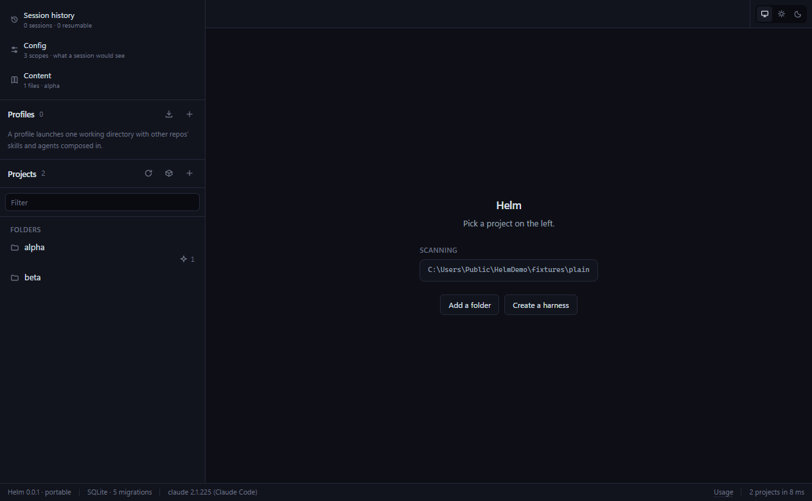
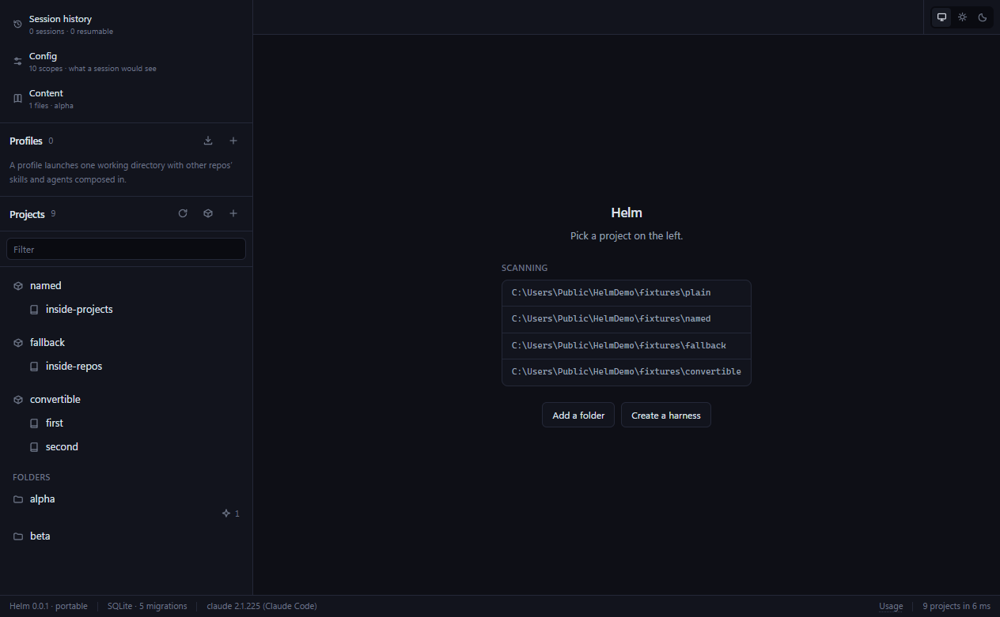
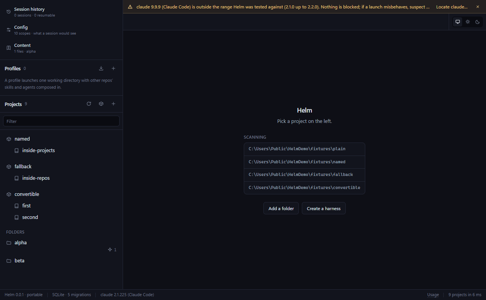

# Helm

A portable, configurable desktop shell **on top of** Claude Code. Not a client,
not a reimplementation - Helm hosts the real `claude` TUI in an embedded terminal
and owns everything that happens *before* and *after* a session.



## Why

Claude Code resolves `.claude/` configuration (skills, commands, agents, CLAUDE.md)
relative to the working directory. That forces a bad choice at launch time:

| Launch from | You get | You lose |
|---|---|---|
| Harness/workspace root | cross-repo access, workspace tooling | every project-local skill and agent |
| A single repo | that repo's skills and agents | cross-repo access |

Helm dissolves the tradeoff. This is the one idea the whole app is built around,
so it is worth the paragraph:

**Overlay composition.** For each project you want composed in, Helm synthesizes
a throwaway *plugin* in its own data directory - a manifest plus junctions
(`mklink /J`, no elevation) pointing at that project's real `.claude/skills`,
`.claude/commands` and `.claude/agents`. It then launches `claude` **from the
root you chose** with one `--plugin-dir` per overlay, `--add-dir` for the files
the session may touch, and the overlays' `CLAUDE.md` files concatenated into a
single `--append-system-prompt-file`. The result is a session whose working
directory is the workspace root and whose skill set is the union of every repo
you named.

Three measured facts make that predictable rather than hopeful:

- **Namespacing is automatic and deterministic.** The platform prefixes
  everything a plugin contributes with the plugin's manifest name, and Helm
  chooses that name. A skill called `think` in a repo overlaid as `api` is
  `/api:think`. Two repos that both define `think` both resolve, each under its
  own prefix - collisions cannot occur, so Helm predicts names instead of
  detecting clashes.
- **`--add-dir` does not carry an overlaid repo's `CLAUDE.md`.** Measured on
  2.1.225: a session launched from the root with both flags reported only the
  user and cwd instruction files. That is why the instructions go through
  `--append-system-prompt-file` - a *file*, because two repos here total 34 KB
  against a 32,767-character Windows command line.
- **The shims live under the app data directory, never `%TEMP%`.** Their
  subdirectories are junctions into your real repositories, and a temp cleaner
  that follows a reparse point instead of unlinking it deletes the repo's
  `.claude/skills`. They are swept only at app start.

A saved composition is a **profile**: root + overlays + access + model, effort,
permission mode, MCP set and opening prompt. One click to launch, exportable as
YAML so it travels with the workspace.

## Install

Windows 10/11, x64. No admin rights are needed for either option.

**Portable** - download `Helm-<version>-portable.exe`, put it wherever you like
and run it. It keeps everything in a `helm-data\` folder beside itself, so the
whole install travels on a stick and removing it is deleting two things.

**Installed** - download `Helm-<version>-setup.exe` and run it. It installs for
your user only, into `%LOCALAPPDATA%\Programs\Helm`, and keeps its data in
`%APPDATA%\Helm`. Uninstalling removes the program and **keeps** your data - the
database holds your profiles, session index and config snapshots.

You also need Claude Code itself. Helm runs the real `claude` CLI; it does not
bundle one and it never handles your credentials. If you have not signed in,
first run says so and asks you to run `claude` once in a terminal - that is the
entire flow, and there is no login screen anywhere in this app.

### First run

Three things, in the order they matter:

1. **Claude Code.** Helm looks on `PATH` and in the usual install directory. If
   it is somewhere unusual, point at it by hand; the file is run with
   `--version` before it is accepted. The tested range is 2.1.0 up to 2.2.0 -
   outside it you get a warning strip and nothing is blocked.
2. **Signed in.** Detected from the presence of a login, never by reading one.
   The remedy is to run `claude` yourself.
3. **Where your work is.** Add a folder, or create a harness. Nothing is scanned
   until you say what to scan.

A folder of ordinary repositories is enough - there is no required layout, and
Helm is useful pointed at a directory with no harness anywhere in sight.

### Harnesses

A *harness* is any folder with a `harness.yaml` in it. That is the whole
definition. Helm reads four optional keys:

```yaml
name: "work"        # what the sidebar calls it
template: "minimal" # informational
version: "1"        # manifest format
repos: "projects"   # where the repositories are; omit for `repos/`
```

`repos:` is the one that matters for an existing folder. Without it a harness
lists `repos/*` and nothing else, so dropping a manifest into a folder whose
repositories sit at its **top level** would hide all of them. `repos: "."` says
they are right here. The "turn a folder into a harness" action writes that for
you.

Creating a harness scaffolds the minimum and nothing else - `harness.yaml`,
`repos/`, an empty `.claude/`. No starter skills, notes or rules: what belongs
in a harness is yours to decide.



## What it does

- **Profiles.** The saved composition described above. One click to launch,
  exportable as YAML.
- **A terminal that hosts the real thing.** xterm.js + node-pty running the
  unmodified `claude` TUI in tabs. Helm supplies argv, cwd and environment, then
  gets out of the way - it renders no messages, parses no output, handles no
  permission prompts.
- **Project discovery.** Workspaces and their repos, auto-detected, with each
  one's skill/agent/command counts and git state at a glance.
- **Session history.** Every session recorded in `~/.claude/history.jsonl`,
  across every directory - which the CLI's `/resume` cannot show you, because it
  reads only the one you started it in. Grouped by project, searchable by prompt
  text, resumable into a tab.

  Claude Code keeps prompts indefinitely and reaps the transcripts behind them,
  so most of that list is a record rather than a door. Helm marks which is which
  instead of offering a resume that fails.
- **A config console** over every `.claude` tree in reach: browse, edit, and an
  *effective view* that answers "what would a session launched here actually
  see". Every write is snapshotted first, so every edit has an undo.
- **A content viewer** for the markdown, notes and HTML artifacts Claude writes,
  with wikilinks and a sandboxed frame for artifacts.
- **Usage in the status bar** - session and weekly percentages read from Claude
  Code's own cached figures, or an estimate in dollars. A reading Helm cannot
  stand behind shows nothing at all rather than a stale number.

### The version guard warns; it never gates



Claude Code's flags are a stable public surface and a newer CLI is far more
likely to work than not, so Helm pins a tested range, says when you are outside
it, and otherwise stays out of the way.

## Updates

There is no auto-updater, on purpose - see
[docs/PACKAGING.md](docs/PACKAGING.md) for the three reasons. Helm can ask
GitHub whether a newer release exists when you ask it to; that is the only
outbound request the app makes, and it never happens on a timer.

## Architecture

```
packages/
├── core/      # headless: launch/, discovery/, config/, content/, store/ - ZERO electron imports
├── ui/        # React components
└── desktop/   # Electron main + preload + renderer + pty host
```

Stack: Electron, TypeScript strict, React + Vite, Tailwind, xterm.js + node-pty,
better-sqlite3 + Drizzle, electron-builder (portable + NSIS).

`core` and `ui` export TypeScript source rather than a build output, so the
bundler compiles them in and there is one build step instead of three.

The one hard rule: **`core/` never imports Electron** (ESLint-enforced). That is
what keeps the app portable and a future mobile client possible.

## Documentation

- [docs/SPEC.md](docs/SPEC.md) - the v1 spec, with the measured evidence behind
  each design decision. Read this before changing anything.
- [CLAUDE.md](CLAUDE.md) - the rules that are load-bearing rather than stylistic,
  and why each one is there.
- [docs/PACKAGING.md](docs/PACKAGING.md) - what the build produces, where data
  goes, and why there is no auto-updater.
- [docs/TASKS.md](docs/TASKS.md) - what is built and what is not.
- [docs/SPIKE-B.md](docs/SPIKE-B.md), [docs/SPIKE-C.md](docs/SPIKE-C.md) - the
  packaging and terminal-fidelity findings the current configuration rests on.

## Development

Requires Node 22+ and pnpm 10. `node-linker=hoisted` is set in `.npmrc` because
packaging native modules into a portable exe needs the flat `node_modules`
shape.

```bash
pnpm install
pnpm dev               # the app, with hot reload
pnpm check             # typecheck + lint + unit tests (what CI runs)
pnpm dist:win          # portable exe + NSIS installer
```

Beyond the unit tests there are two families of driver. Both are real: they open
windows, click things, and most of them spawn actual `claude` processes, so they
take minutes and cost tokens.

The terminal harnesses render their own page (`spike.html`) and open no
database. They guard the pty and xterm configuration, every line of which
prevents a specific measured failure:

```bash
pnpm shell             # interactive pane hosting pwsh
pnpm --filter @helm/desktop claude   # ...hosting the real claude TUI
pnpm fidelity          # terminal fidelity            (C1-C9)
pnpm claude-check      # the real TUI in the pane      (D0-D7)
pnpm selftest          # native modules in a packaged build
```

The app drivers go through the real window - clicking sidebar rows, typing into
search boxes - rather than calling the main process directly, so what they prove
is that the thing on screen is wired to the thing underneath:

```bash
pnpm m2-check          # sessions, tabs, teardown
pnpm m3-check          # overlay composition, asked of a live session
pnpm m4-check          # the session index, checked against ~/.claude itself
pnpm m5-check          # the config console, and a live session's own answer
pnpm m6-check          # markdown, wikilinks, and the artifact sandbox
pnpm usage-check       # the status bar's figures, against /usage
pnpm m7-check          # first run, the repos: key, and the built artefacts
```

All of them accept `--only=` to re-run part of a run (`--only=C5,C6`,
`--only=list,search`) and write a JSON report and screenshots to the app data
directory. **The report is the verdict, not the exit status** - node-pty's
teardown can lose the exit code after the checks have already passed.

`m7-check` is the one that runs a whole second copy of the app: first run is
driven against an empty profile in a temporary directory, using the app's own
portable-mode mechanism as the isolation, so nothing of yours is touched.

Schema changes go through Drizzle:

```bash
pnpm db:generate       # drizzle-kit generate, then embed the SQL into the bundle
```

### Releasing

Bump `version` in `packages/desktop/package.json` and merge it to `main`. That
is the whole procedure. `.github/workflows/release.yml` runs the checks, builds
both artefacts on a clean Windows runner, and publishes a GitHub release tagged
`v<version>` with the exes attached and the commits since the previous tag as
its notes.

A merge that does not change the version runs the checks and stops there, so
`main` is always checked and only a bump cuts a release. Nothing is built on
anybody's laptop, which is the point: the one time a release *was*, a stale
`pnpm.exe` shadowed the managed one and shipped an exe with no
`app.asar.unpacked` that died on its first `dlopen`.

```bash
pnpm verify:artifact   # assert a built exe carries its unpacked native modules
```

[docs/PACKAGING.md](docs/PACKAGING.md) has the reasoning, including why the
release is published outright rather than left as a draft.

## License

MIT - see [LICENSE](LICENSE).
